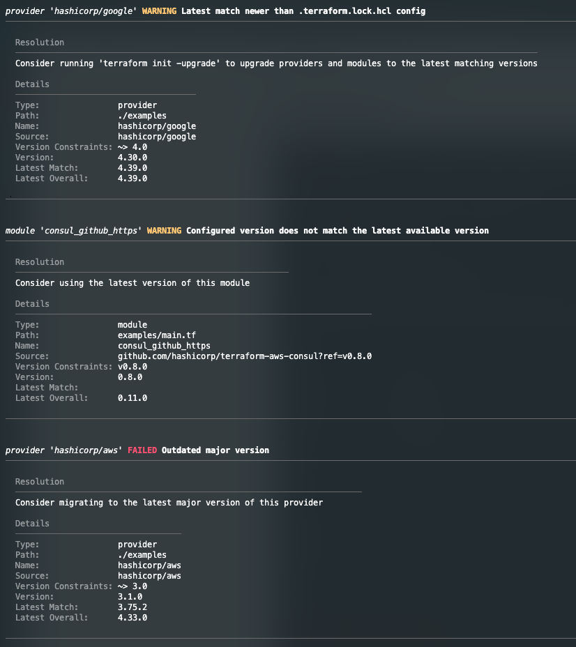

---
hide:
  - navigation
  - toc
---

# Home

  

Terraform version check (tfvc) is a reporting tool to identify available updates for providers and modules referenced in your Terraform code. It provides clear warning/failure
output and resolution guidance for any issues it detects.

